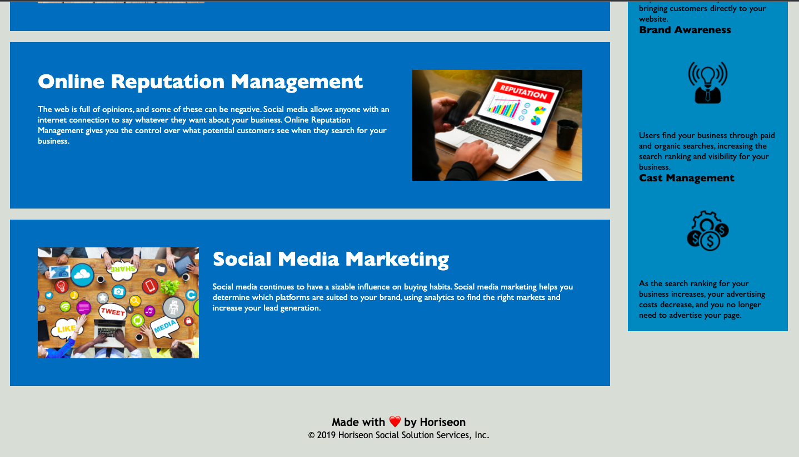

## Marketing-Refactor-Project-

Refactor a marketing agency website to use semantic HTML
I have used HTML semantic tags and external CSS style sheets to style the page

## Link to URL

Click the link to view the website
[here] (https://github.com/roxywasiak/Marketing-Refactor-Project-)

## screenshots

Here are the screenshots of the pages Header, Main Section and Footer.

