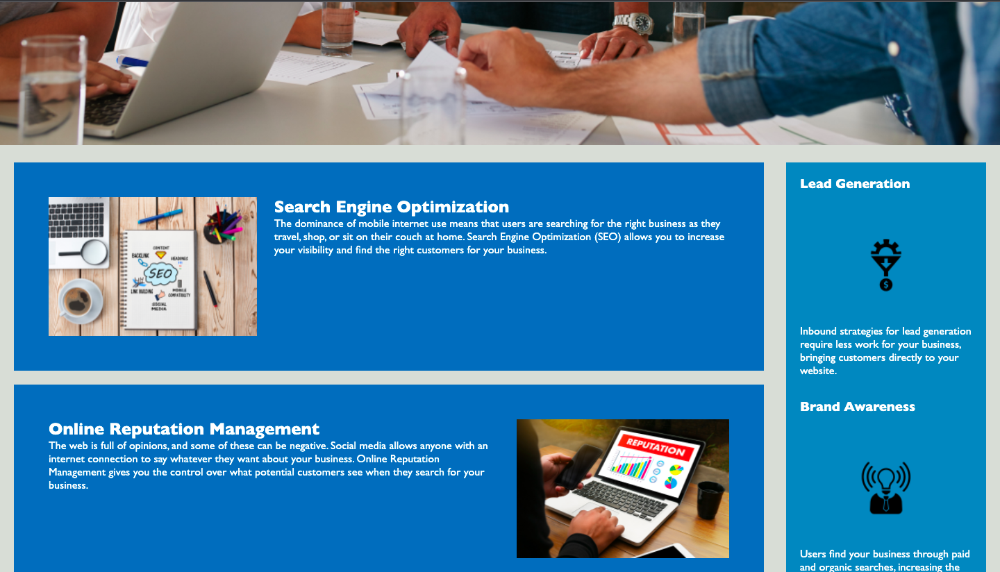
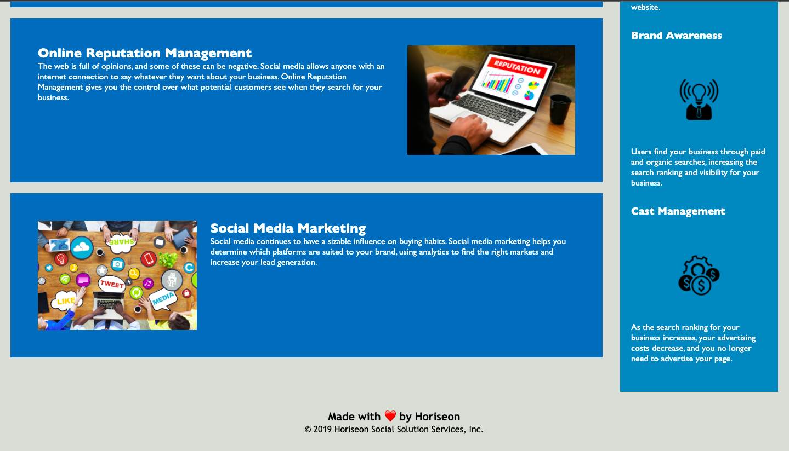

## marketing-agency-website

Refactor a marketing agency website to use semantic HTML
I have used HTML semantic tags and external CSS style sheets to style the page.
I have addressed the div classes and targeted the styles to stop the repetition.

## Link to URL

Click the link to view the website
[here] (https://roxywasiak.github.io/marketing-agency-website/)

## screenshots

Here are the screenshots of the pages Header, Main Section and Footer.

